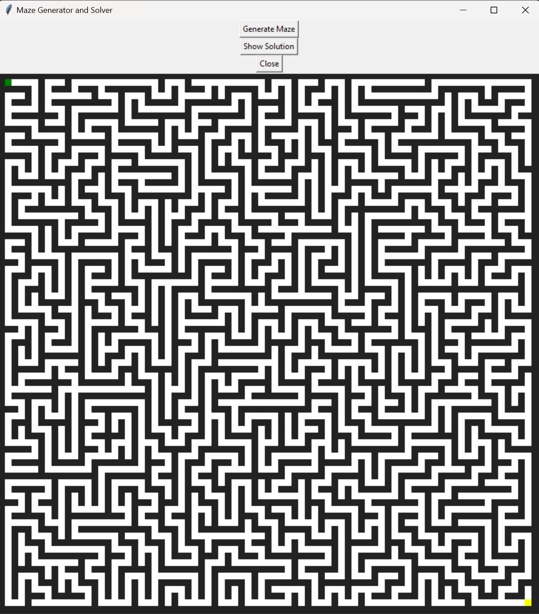

# MazeVisualizer(maze, cell_size=10, delay_ms=5)
| Parameter  | Description                                                   | Default Value|
| ---        |    ----                                                       |     ---      |
| maze       | Instance of Maze class                                        | **Required** |
| cell_size  | Cell Size in Pixels                                           | 10           |
| delay_ms   | Milliseconds to wait after each maze update during generation | 5            |


## Maze Generation Simulation
When an instance of Maze is created, the maze is already generated but the generation path is stored in Maze.generation_path

Using Maze.generation_path, MazeVisualizer is able to simulate the generation of an already generated maze

## Examples
```python
from CamsMazes.maze import Maze
from CamsMazes.maze_visualizer import MazeVisualizer

# Must first create Maze
maze = Maze(num_rows=40, num_cols=40)

# MazeVisualizer must be created with Maze
maze_visualizer=MazeVisualizer(maze) # GUI will automatically open and maze generation simulation will begin

# Setting cell size
maze_visualizer_2=MazeVisualizer(maze, cell_size=15) # Each cell in maze will be 15 pixels x 15 pixels

# Setting Delay
maze_visualizer_3=MazeVisualizer(maze, delay_ms=1) # Delay (in milliseconds) between each maze update during maze generation
```
## GUI
Below is a screenshot of the GUI after the maze generation has finished. 

The Maze is a 40 by 40 Maze with a Cell Size of 10. 

The green cell represents the start cell and the yellow square represents the end cell

